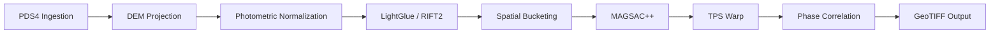

# LunaX

**SIH 2026 Project:** Multi-modal, Sun angle and scale invariant image correspondence using Chandrayaan-2 optical images (OHRC, TMC and IIRS).

## Overview
LunaX provides an automated, end-to-end registration pipeline for Chandrayaan-2 imagery. It leverages PDS4 metadata and lunar Digital Elevation Models (DEM) to perform coarse geometric orthorectification, applies physics-based photometric normalization for illumination invariance, and utilizes a robust feature matching ensemble (LightGlue + RIFT2) combined with MAGSAC++ and Thin Plate Splines (TPS) to achieve sub-pixel, scale-invariant, and multi-modal image registration.

## Architecture Pipeline


## Key Features
- **Scale Invariant:** Normalizes extreme 320x scale differences (0.25m OHRC to 80m IIRS) via 3D DEM ray-tracing.
- **Sun Angle Invariant:** Reverses physical shadow/illumination variance using PDS4 solar incidence angles.
- **Multi-modal Invariant:** Bridges the visible/hyperspectral gap using deep learning (LightGlue) and phase congruency (RIFT2).
- **Sub-pixel Accuracy:** Achieves extreme precision via FFT-based phase correlation.
- **Uniform Distribution:** Guarantees spatially uniform tiepoints through algorithmic bucketing.

## Repository Structure
```text
LunaX/
├── data/          # Raw PDS4 and DEM files (Ignored)
├── docs/          # Technical documentation
├── src/           # Core pipeline source code
├── scripts/       # CLI entry points
├── tests/         # Unit tests
├── notebooks/     # Prototyping
└── outputs/       # Registered GeoTIFF products
```

## Documentation
Please refer to the `/docs` directory for the complete technical specification:
- [Problem Statement](docs/problem-statement.md)
- [Solution Overview](docs/solution-overview.md)
- [System Architecture](docs/system-architecture.md)
- [Data Flow](docs/data-flow.md)
- [Algorithms](docs/algorithms.md)
- [Multimodal Matching](docs/multimodal-matching.md)
- [Geometry and Photometry](docs/geometry-and-photometry.md)
- [Matching and Registration](docs/matching-and-registration.md)
- [Evaluation Plan](docs/evaluation.md)
- [Experiments](docs/experiments.md)
- [Implementation Plan](docs/implementation-plan.md)
- [Software Stack](docs/software-stack.md)
- [Project Structure](docs/project-structure.md)
- [Risks and Limitations](docs/risks-and-limitations.md)
- [SIH Presentation](docs/sih-presentation.md)
- [Demo Plan](docs/demo-plan.md)
- [FAQ](docs/faq.md)
- [Consistency Report](docs/consistency-report.md)

## Setup Instructions
*(Placeholder: Installation and usage instructions will be added here once implementation begins.)*

## Project Status
- **Status:** `Research` / `Planned`
- **Current Phase:** Transitioning from research documentation to Phase 1 implementation (Data Ingestion).

---
*Built for the Smart India Hackathon 2026.*
