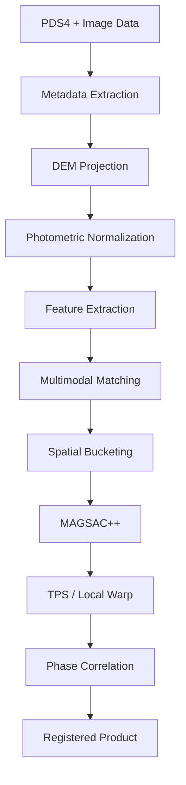

# Solution Overview

## High-Level Architecture
Our solution leverages a multi-stage pipeline designed to progressively eliminate differences in geometry, photometry, and modality before performing robust feature matching and local deformation.

## End-to-End Pipeline
1. **Data Ingestion:** PDS4 labels are parsed to extract metadata, geometry, and Sun illumination parameters.
2. **DEM Projection (Orthorectification):** Images are ray-traced to a common lunar DEM. This removes scale and viewpoint differences, bringing all images to a common ground grid.
3. **Photometric Normalization:** Images are corrected for illumination variance using CLAHE, histogram matching, and a physics-based Sun incidence angle correction.
4. **Multimodal Feature Matching:** Features are extracted and matched using a hybrid LightGlue + RIFT2 ensemble.
5. **Match Regularization:** Matches are distributed into spatial buckets to ensure uniform coverage across the image.
6. **Robust Registration:** MAGSAC++ removes outliers and estimates an initial robust transform.
7. **Local Deformation:** Thin Plate Splines (TPS) are used to compute a local warp that handles non-planar terrain residuals.
8. **Sub-pixel Refinement:** Phase correlation is applied to local patches to achieve sub-pixel accuracy.
9. **Registered Product Generation:** The final image is warped and saved as a georeferenced product.

## Pipeline Flowchart

## Why Each Stage Exists
- **Metadata Extraction:** Provides the crucial ephemeris and Sun angle parameters needed for physics-based correction.
- **DEM Projection:** Eliminates massive scale discrepancies (0.25m vs 80m) and perspective parallax early on.
- **Photometric Normalization:** Solves the "Sun angle invariant" requirement by simulating a standard illumination geometry.
- **Multimodal Feature Matching:** Solves the "Multi-modal invariant" requirement using AI (LightGlue) and phase-congruency (RIFT2) to bridge visible and IR domains.
- **Spatial Bucketing:** Ensures registration doesn't overfit to a single highly-textured crater, providing uniform accuracy.
- **MAGSAC++:** Provides superior outlier rejection compared to standard RANSAC.
- **TPS / Local Warp:** Corrects localized terrain deformations that a global homography cannot handle.
- **Phase Correlation:** Pushes the accuracy from pixel-level to sub-pixel level.
